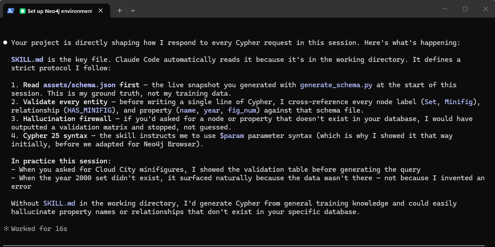

# Neo4j Dynamic Schema Guardrail & Cypher 25 Assistant

> A universally reusable, open-standard **Agent Skill** built on the Agent Instruction Protocol (AIP). This package acts as a zero-hallucination semantic adapter, forcing AI coding agents to dynamically validate prompts against your live Neo4j database structure before generating Cypher 25 queries.

Unlike generic Cypher assistants, this skill acts as a **strict compliance firewall** — preventing the agent from fabricating missing properties, nodes, or relationships that do not exist in your schema, enforcing property types, and correcting relationship directions before a single line of Cypher is written.

---



## Table of Contents

- [Overview](#overview)
- [How It Works](#how-it-works)
- [Repository Layout](#repository-layout)
- [Prerequisites](#prerequisites)
- [Installation](#installation)
- [Configuration](#configuration)
- [Usage](#usage)
  - [Step 1: Generate Your Schema](#step-1-generate-your-schema)
  - [Step 2: Activate the Skill](#step-2-activate-the-skill)
- [Schema Sources](#schema-sources)
- [Schema Validation Example](#schema-validation-example)
- [Property Type Validation Example](#property-type-validation-example)
- [Relationship Direction Validation Example](#relationship-direction-validation-example)
- [Cypher Generation Example](#cypher-generation-example)
- [Changelog](#changelog)
- [Contributing](#contributing)
- [License](#license)

---

## Overview

AI agents working with graph databases frequently hallucinate by inventing node labels, relationship types, or properties that do not exist. This skill eliminates that failure mode entirely by grounding every query generation step in a live, machine-readable snapshot of your Neo4j schema.

**Zero-Hallucination Guardrails:**

- The agent reads `assets/schema.json` before writing a single line of Cypher.
- Any entity not found in the schema causes an immediate halt and a structured validation report.
- Filter values are checked against the declared property type — type mismatches halt generation.
- Relationship directions are enforced from the schema — wrong arrows are caught and corrected.
- All generated queries use modern **Cypher 25** parameter syntax (`$param`).

---

## How It Works

```
User Prompt
    │
    ▼
┌─────────────────────────────────┐
│  1. Read assets/schema.json     │  ← Ground truth from your live DB
└────────────────┬────────────────┘
                 │
    ▼
┌─────────────────────────────────┐
│  2. Entity Verification         │  ← Cross-reference labels, rels, props
└────────────────┬────────────────┘
                 │
    ▼
┌─────────────────────────────────┐
│  3. Property Type Enforcement   │  ← Filter values must match declared types
└────────────────┬────────────────┘
                 │
    ▼
┌─────────────────────────────────┐
│  4. Relationship Direction Check│  ← Arrow direction enforced from schema
└────────────────┬────────────────┘
                 │
         ┌───────┴───────┐
         │               │
    PASS ▼          FAIL ▼
┌──────────────┐  ┌─────────────────────────────┐
│ Generate     │  │ Output Schema Validation     │
│ Cypher 25    │  │ Matrix — halt, do not guess  │
└──────────────┘  └─────────────────────────────┘
```

---

## Repository Layout

```text
neo4j-dynamic-schema-guardrail/
├── SKILL.md                        # AIP metadata and guardrail instructions
├── README.md                       # Setup, documentation, and architecture guide
├── assets/
│   └── schema.json                 # Populated ground-truth graph schema (git-ignored in live use)
├── scripts/
│   ├── generate_schema.py          # Pull schema from an existing Neo4j DB via APOC
│   ├── define_schema.py            # Interactively define schema.json for a new database
│   └── import_neo4j_schema.py      # Convert Neo4j standard JSON format to guardrail format
└── examples/
    └── star-wars-lego/
        ├── README.md               # Step-by-step instructions for the example
        ├── import_starwars.py      # Loads themes and sets
        ├── import_minifigs.py      # Links minifigures to sets
        └── data/                   # Pre-filtered Star Wars CSV data (all 5 themes)
            ├── themes.csv
            ├── sets.csv
            ├── minifigs.csv
            ├── inventories.csv
            └── inventory_minifigs.csv
```

---

## Prerequisites

- **Python** 3.9 or higher
- A running **Neo4j** instance (local or remote) with the **APOC** plugin installed
- The `neo4j` Python driver

Verify APOC is available on your instance:

```cypher
CALL apoc.meta.schema()
```

If the procedure is not found, install the [APOC plugin](https://neo4j.com/labs/apoc/) for your Neo4j version before proceeding.

---

## Installation

Clone the repository and install the Python driver:

```bash
git clone https://github.com/your-username/neo4j-dynamic-schema-guardrail.git
cd neo4j-dynamic-schema-guardrail
pip install neo4j
```

---

## Configuration

The schema generation script reads connection details from environment variables. Set them before running:

```bash
# Linux / macOS
export NEO4J_URI="bolt://localhost:7687"
export NEO4J_USERNAME="neo4j"
export NEO4J_PASSWORD="your-password"
```

```powershell
# Windows PowerShell
$env:NEO4J_URI      = "bolt://localhost:7687"
$env:NEO4J_USERNAME = "neo4j"
$env:NEO4J_PASSWORD = "your-password"
```

If no environment variables are set, the script falls back to `bolt://localhost:7687` with the credentials `neo4j` / `password`.

---

## Usage

### Step 1: Generate Your Schema

Run the sync script to pull your live schema and write it to `assets/schema.json`:

```bash
python scripts/generate_schema.py
```

A successful run prints:

```
🔄 Connecting to Neo4j instance at bolt://localhost:7687...
✅ Success! Your live Neo4j schema has been mapped to assets/schema.json
```

Re-run this script any time your database schema changes to keep the guardrail in sync.

### Step 2: Activate the Skill

Add this repository as an Agent Skill in your AI coding agent (Claude Code, Cursor, Windsurf, etc.) by pointing the agent at `SKILL.md`. The agent will then automatically:

1. Read `assets/schema.json` before every Cypher generation task.
2. Validate all requested entities against the schema.
3. Either generate a valid Cypher 25 query or emit a schema validation report.

---

## Schema Sources

The guardrail works with `assets/schema.json` regardless of how it was created. Three paths are supported:

### Existing Database (APOC)
Pull the schema directly from a live Neo4j instance:
```bash
python scripts/generate_schema.py
```
Requires APOC installed on your instance.

---

### New Database (Interactive)
Define your schema from scratch without a live database:
```bash
python scripts/define_schema.py
```
The script walks you through adding node labels, properties, and relationships interactively and writes the result to `assets/schema.json`.

---

### Neo4j Standard JSON Format
If you have a schema produced by [graph-schema-introspector](https://github.com/neo4j/graph-schema-introspector), [graph-schema-json-js-utils](https://github.com/neo4j/graph-schema-json-js-utils), or [mcp-neo4j-data-modeling](https://github.com/neo4j-contrib/mcp-neo4j/tree/main/servers/mcp-neo4j-data-modeling), convert it to the guardrail format in one step:
```bash
python scripts/import_neo4j_schema.py path/to/your-neo4j-schema.json
```

---

## Schema Validation Example

Given the example schema in `assets/schema.json` (containing `Theme` and `Set` nodes connected by `HAS_SET`), a prompt that references a non-existent label produces a validation halt:

**Prompt:** "Find all `Product` nodes linked to a `Category`."

**Agent output:**

```
Schema Validation Report
━━━━━━━━━━━━━━━━━━━━━━━━━━━━━━━━━━━
Requested Entity    | Status
─────────────────── | ──────
Node: Product       | ❌ NOT FOUND in schema
Node: Category      | ❌ NOT FOUND in schema
━━━━━━━━━━━━━━━━━━━━━━━━━━━━━━━━━━━
Halting. No Cypher generated. Please verify entity names against assets/schema.json.
```

---

## Property Type Validation Example

The schema declares `Set.year` as `INTEGER` and `Set.pieces` as `INTEGER`. Passing a string value for either property triggers a type mismatch halt.

**Prompt:** "Find all sets where pieces is 'unknown'."

**Agent output:**

```
Schema Validation Report
━━━━━━━━━━━━━━━━━━━━━━━━━━━━━━━━━━━━━━━━━━━━
Requested Filter        | Schema Type | Supplied Type | Status
─────────────────────── | ─────────── | ────────────  | ──────
Set.pieces = 'unknown'  | INTEGER     | STRING        | ❌ TYPE MISMATCH
━━━━━━━━━━━━━━━━━━━━━━━━━━━━━━━━━━━━━━━━━━━━
Halting. No Cypher generated. Set.pieces expects an INTEGER value.
```

**Prompt:** "Find all sets from the year 1999." *(valid — 1999 is an INTEGER)*

```cypher
MATCH (s:Set)
WHERE s.year = $year
RETURN s.name AS setName, s.id AS setId, s.pieces AS pieces
ORDER BY s.name
```

```
Parameters: { year: 1999 }
```

---

## Relationship Direction Validation Example

The schema declares `HAS_SET` with direction `out` from `Theme` and `HAS_MINIFIG` with direction `out` from `Set`. Reversing either arrow returns zero results silently — the guardrail catches and corrects this.

**Prompt:** "Find all themes for a given set." *(implies traversal from Set to Theme)*

**Agent output:**

```
Direction Check
━━━━━━━━━━━━━━━━━━━━━━━━━━━━━━━━━━━━━━━━━━━━━━━━━━━━━━━━━━━━━━━
Relationship   | Schema Direction  | Prompt Direction  | Action
────────────── | ────────────────  | ────────────────  | ──────
HAS_SET        | Theme ──→ Set     | Set ──→ Theme     | ↩ Corrected
━━━━━━━━━━━━━━━━━━━━━━━━━━━━━━━━━━━━━━━━━━━━━━━━━━━━━━━━━━━━━━━
Direction corrected. Generating query with schema-compliant arrow.
```

```cypher
MATCH (t:Theme)-[:HAS_SET]->(s:Set)
WHERE s.id = $setId
RETURN t.name AS themeName
```

```
Parameters: { setId: "10123-1" }
```

---

## Cypher Generation Example

A valid prompt against the same schema:

**Prompt:** "List all Sets belonging to the Theme named 'Technic', returning the set name, year, and piece count."

**Generated Cypher 25:**

```cypher
MATCH (t:Theme {name: $themeName})-[:HAS_SET]->(s:Set)
RETURN s.name AS setName, s.year AS year, s.pieces AS pieces
ORDER BY s.year DESC
```

```
Parameters: { themeName: "Technic" }
```

All returned fields (`name`, `year`, `pieces`) are confirmed present in the `Set` node schema before generation.

---

## Changelog

### v1.1.0 — 2026-06-04
**Added: Property Type Enforcement and Relationship Direction Validation**
- `SKILL.md` updated with two new guardrail rules:
  - **Rule 4 — Property Type Enforcement:** Filter values are validated against the declared property type in `schema.json` before Cypher is generated. Type mismatches halt generation and report the conflict.
  - **Rule 5 — Relationship Direction Enforcement:** Arrow direction is read from `schema.json` and enforced in every generated query. Wrong directions are corrected and flagged in the output.
- Inspired by validation patterns from [graph-guard](https://github.com/c-fraser/graph-guard) and [cypher-query-validator](https://github.com/yWorks/cypher-query-validator).

**Added: Broader Schema Source Support**
- `scripts/define_schema.py` — new interactive script to build `assets/schema.json` for a new database without a live Neo4j connection.
- `scripts/import_neo4j_schema.py` — new converter that translates the Neo4j standard graph schema JSON format (from `graph-schema-introspector`, `graph-schema-json-js-utils`, or `mcp-neo4j-data-modeling`) into the guardrail's APOC-compatible format.
- The guardrail now fits both the *existing database* and *define-first* workflow patterns used across the Neo4j ecosystem.

---

## Contributing

1. Fork the repository and create a feature branch.
2. Update `assets/schema.json` by running `scripts/generate_schema.py` against a representative database.
3. Open a pull request with a clear description of the change and the schema diff.

---

## License

This project is released under the [MIT License](LICENSE).
